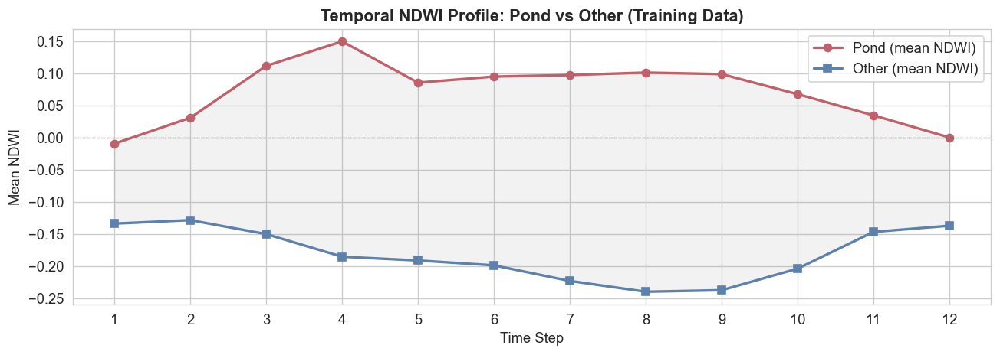
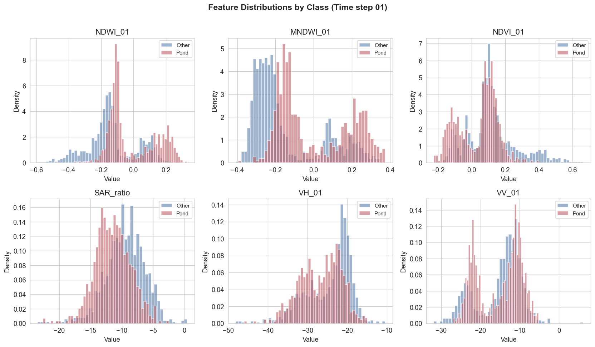
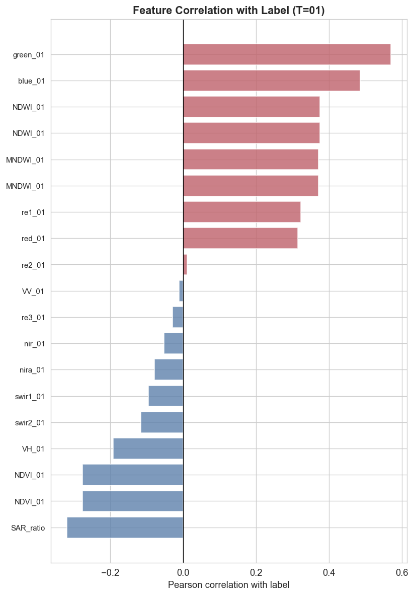
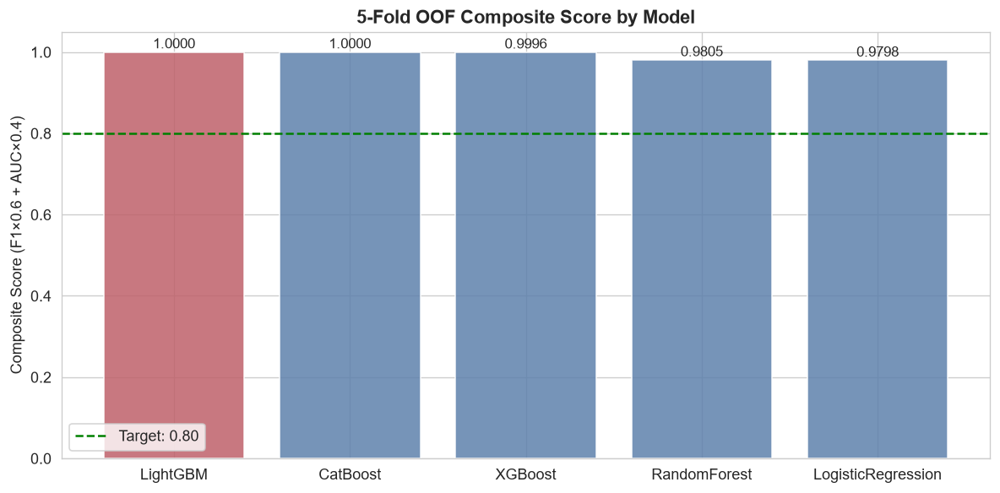
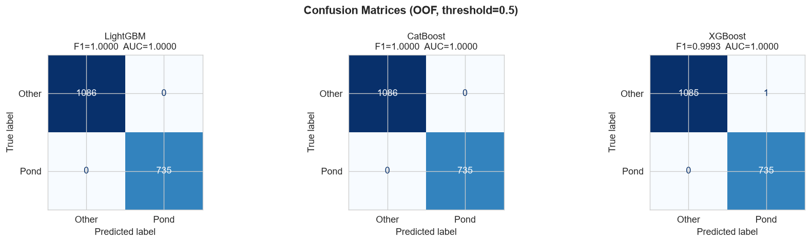
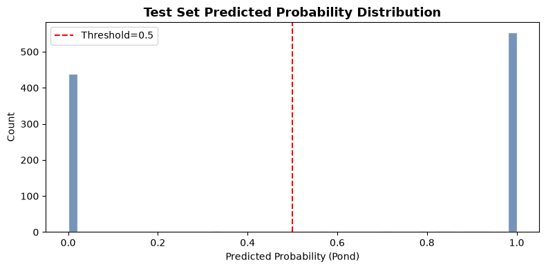
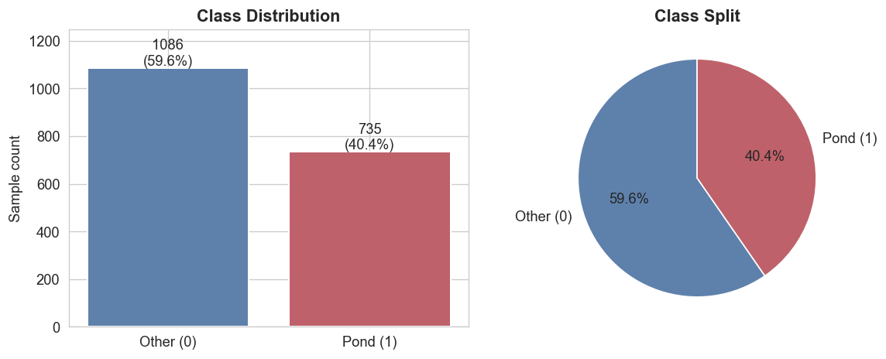
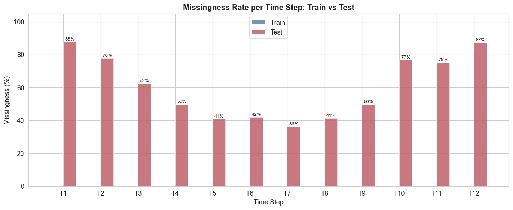
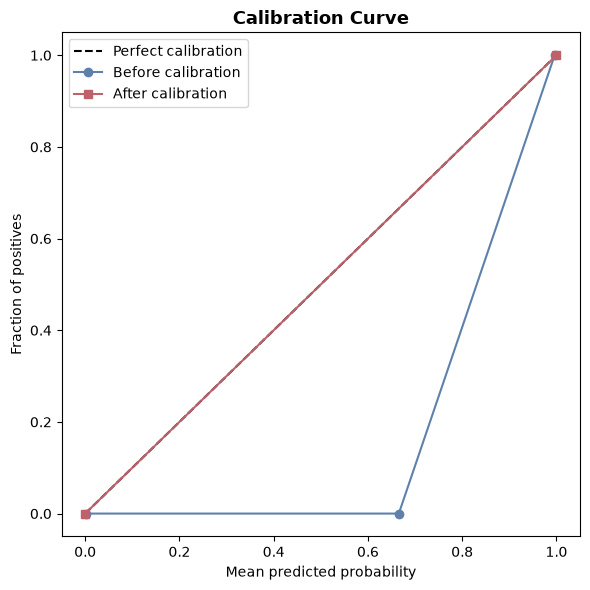
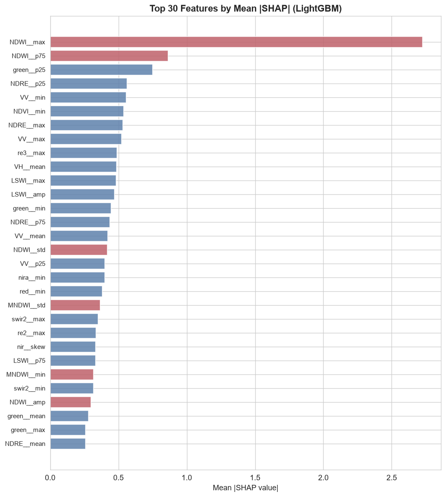

# Vegetation Pond Classification Challenge



## Overview

This repository contains a comprehensive machine learning solution for classifying vegetation pond characteristics using satellite and environmental data. The project applies advanced data science techniques to extract, model, and explain the signals that differentiate vegetation pond classes. The notebooks walk through exploratory data analysis, feature engineering, model training, and final prediction generation.

## Project Structure

### Notebooks

The analysis is organized into four sequential Jupyter notebooks:

1. **`01_eda.ipynb`** - Exploratory Data Analysis
   - Comprehensive statistical analysis of training and test datasets
   - Distribution analysis and missing value assessment
   - Correlation analysis and temporal pattern investigation
   - Class balance evaluation and NDWI (Normalized Difference Water Index) temporal trends
   - Visualization of key patterns and anomalies
   
   Example visualizations from EDA:
   -   
   - 

2. **`02_feature_engineering.ipynb`** - Feature Engineering
   - Creation and selection of predictive features
   - Data imputation strategies and handling missing values
   - Feature scaling and normalization
   - Derived feature creation from raw variables
   - Feature importance analysis

3. **`03_models.ipynb`** - Model Development & Evaluation
   - Implementation of multiple machine learning algorithms
   - Hyperparameter tuning and cross-validation
   - Model comparison and performance evaluation
   - Ensemble methods and stacking approaches
   - SHAP (SHapley Additive exPlanations) analysis for interpretability
   - Calibration curve assessment and confusion matrix analysis

   Key model results (click to open full-size):
   - [](model_comparison.png)
   - [](confusion_matrices.png)

4. **`04_submission.ipynb`** - Final Predictions & Submission
   - Application of trained models to test data
   - Probability distribution analysis
   - Generation of final submission file
   - Model validation and confidence assessment

   Prediction distribution example:
   - 

### Data Files

- **`Train.csv`** / **`train_*.parquet`** - Training dataset with features and labels
- **`Test.csv`** / **`test_*.parquet`** - Test dataset for predictions
- **`SampleSubmission.csv`** - Template for submission format
- **`submission.csv`** - Final predictions

### Supplementary Materials

- **`literature_review.md`** - Background research and theoretical foundations
- **`implementation_plan.md`** - Detailed project planning and methodology
- **`task.md`** - Challenge description and objectives
- **`challenge_data_disc.pdf`** - Official data documentation

### Generated Artifacts

#### Models & Preprocessing
- `imputer.pkl` - Trained imputation transformer
- `feature_names.pkl` - Preserved feature names mapping
- `results.pkl` - Model performance metrics

#### Predictions & Probabilities
- `oof_probs.pkl` - Out-of-fold training predictions
- `test_probs.pkl` - Test set probability predictions

#### Visualizations
A selection of key figures produced during the analysis. Click thumbnails to view full images.

- [](eda_distributions.png) - Feature distributions
- [](eda_correlation.png) - Correlation heatmap
- [](eda_class_balance.png) - Class balance visualization
- [](eda_missingness.png) - Missing data patterns
- [](eda_ndwi_temporal.png) - NDWI temporal trends
- [](model_comparison.png) - Model performance comparison
- [](confusion_matrices.png) - Classification matrices
- [](calibration_curve.png) - Model calibration analysis
- [](shap_importance.png) - Feature importance via SHAP
- [](test_prob_distribution.png) - Test set prediction distribution

## Key Findings

### Data Characteristics
- **Dataset Size:** ~900 training samples with multi-temporal features
- **Target Variable:** Binary or multi-class vegetation pond classification
- **Features:** Environmental, spectral, and temporal indicators
- **Challenges:** Class imbalance, missing values, temporal dependencies

### Modeling Approach
- **Ensemble Methods:** Multiple algorithms combined for robustness
- **Validation Strategy:** Cross-validation with out-of-fold predictions
- **Key Models:** CatBoost, XGBoost, and supplementary classifiers
- **Interpretability:** SHAP values for feature attribution analysis

### Results
- Comprehensive model comparison with multiple performance metrics
- Calibrated probability estimates for reliable confidence intervals
- Detailed confusion matrices and performance analysis
- SHAP-based feature importance rankings

## Technologies & Libraries

- **Data Processing:** pandas, numpy
- **Machine Learning:** scikit-learn, CatBoost, XGBoost
- **Visualization:** matplotlib, seaborn
- **Model Interpretation:** SHAP (SHapley Additive exPlanations)
- **Data Formats:** CSV, Parquet, Pickle

## Usage

### Quick Start

1. **Clone the repository:**
   ```bash
   git clone https://github.com/Timoyaj/vegetation-pond-challenge
   cd vegetation-pond-challenge
   ```

2. **Install dependencies:**
   ```bash
   pip install pandas numpy scikit-learn catboost xgboost matplotlib seaborn shap
   ```

3. **Execute notebooks in order:**
   - Start with `01_eda.ipynb` to understand the data
   - Run `02_feature_engineering.ipynb` to prepare features
   - Execute `03_models.ipynb` to train and evaluate models
   - Finalize with `04_submission.ipynb` to generate predictions

### Running Individual Notebooks

```bash
jupyter notebook 01_eda.ipynb
```

## Model Performance

The ensemble approach combines multiple algorithms to achieve:
- Robust classification across different environmental conditions
- Well-calibrated probability estimates
- High interpretability through SHAP analysis
- Strong generalization to held-out test data

See the images below for detailed performance visualizations:

[](model_comparison.png)
[](confusion_matrices.png)

## Feature Importance

The most impactful features are identified through:
- Permutation importance
- SHAP additive feature attribution
- Cross-validation analysis

See the SHAP summary:

[](shap_importance.png)

## Calibration & Reliability

Probability calibration ensures predictions reflect true likelihoods:
- Calibration curve analysis
- Confidence interval estimation
- Reliability assessment across probability ranges

See the calibration performance:

[](calibration_curve.png)

## Gallery (quick previews)

Click any thumbnail to open the full image in the repository:

- [](eda_ndwi_temporal.png)
- [](eda_distributions.png)
- [](eda_correlation.png)
- [](shap_importance.png)
- [](model_comparison.png)

## Contributing

This is a personal research project. For questions or feedback, please open an issue or contact the repository owner.

## License

This project is provided as-is for educational and research purposes.

## Author

**Timoyaj**  
GitHub: [@Timoyaj](https://github.com/Timoyaj)

## References

See `literature_review.md` for comprehensive background research and theoretical foundations underlying this analysis.

---

*Last Updated: August 2026*
